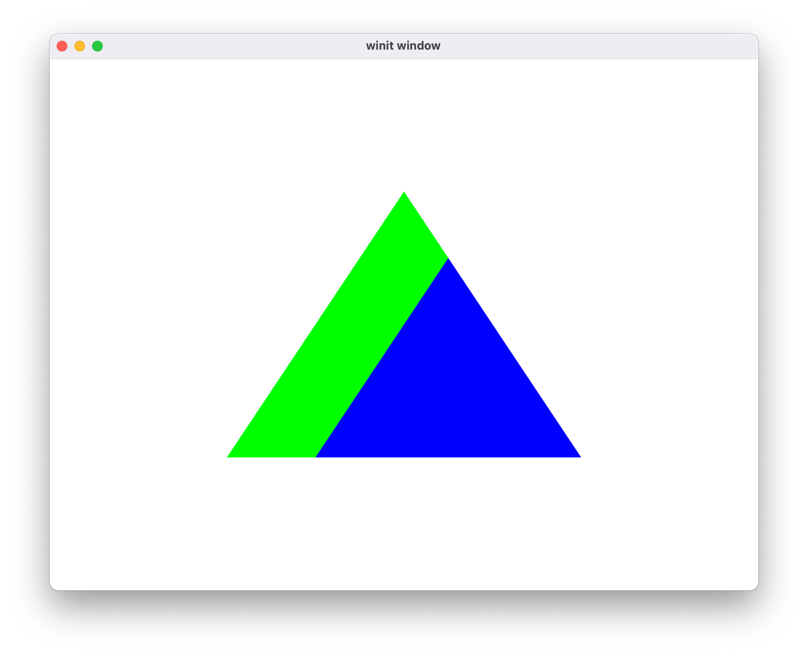
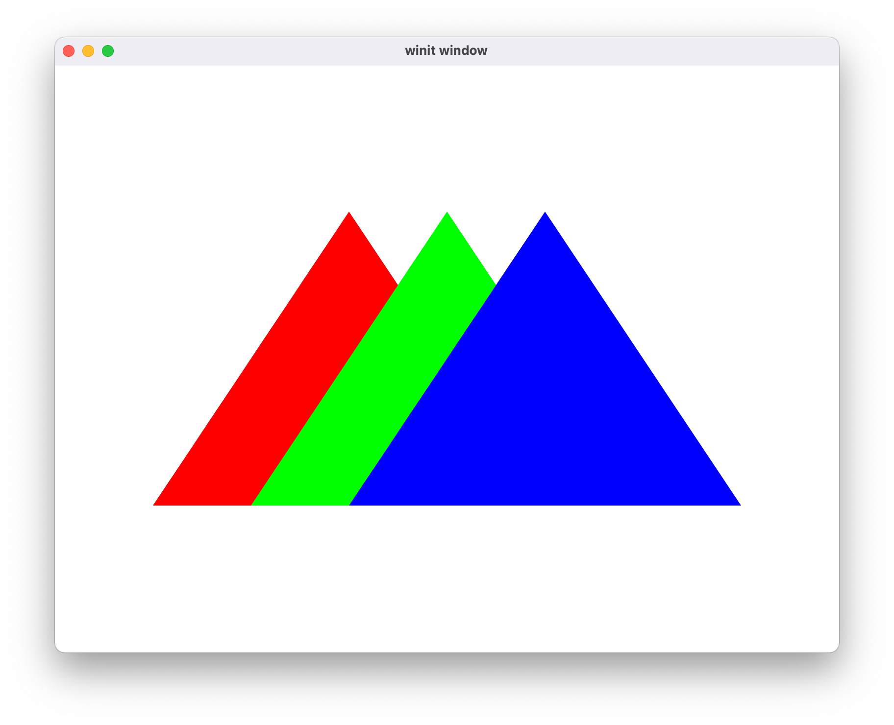

# hello-stencil

This example renders three triangles to a window, passing them through a stencil

## To Run

```
cargo run --example hello-stencil
```

## Screenshots
### correct output

### output without the stencil

